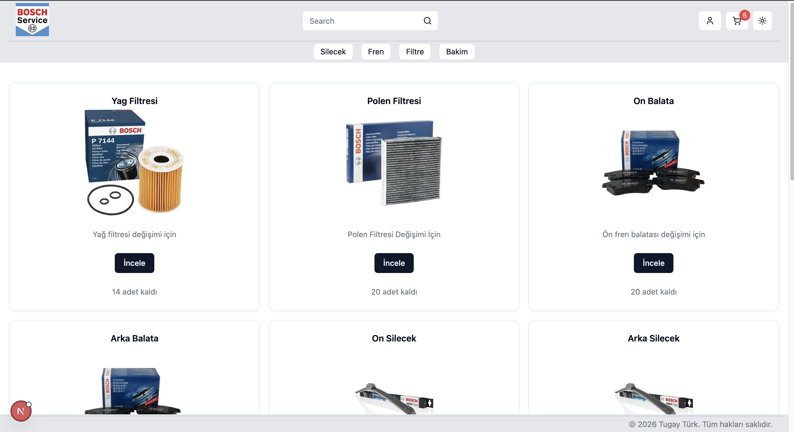

# Ozrenotek Platform

Oto yedek parça ve servis ürünleri için full-stack e-ticaret platformu.

## Ekran Görüntüsü



## Teknolojiler

### Frontend
- **Next.js 16** (App Router)
- **React 19**
- **TypeScript**
- **Tailwind CSS** + **shadcn/ui**
- **Zustand** (State Management)
- **React Hook Form** + **Zod** (Form Validation)
- **Axios** (HTTP Client)

### Backend
- **Strapi 5** (Headless CMS)
- **SQLite** (Veritabanı)
- **TypeScript**

### Ödeme Servisi
- **Express.js 5**
- **Iyzipay** (Sanal POS)

## Özellikler

- Kullanıcı kayıt ve giriş sistemi
- Ürün listeleme ve detay sayfaları
- Kategori bazlı filtreleme
- Ürün arama
- Sepet yönetimi
- Iyzipay ile ödeme entegrasyonu
- Responsive tasarım
- Dark/Light mode desteği

## Kurulum

### Gereksinimler

- Node.js >= 20.0.0
- npm >= 6.0.0

### 1. Backend (Strapi)

```bash
cd backend/carservice-project
npm install
npm run dev
```

Backend varsayılan olarak `http://localhost:1337` adresinde çalışır.

### 2. Frontend (Next.js)

```bash
cd frontend
npm install
npm run dev
```

Frontend varsayılan olarak `http://localhost:3000` adresinde çalışır.

### 3. Ödeme Servisi (Sanalpos)

```bash
cd sanalpos
npm install
```

`.env` dosyası oluşturun:

```env
IYZI_API_KEY=your_api_key
IYZI_SECRET_KEY=your_secret_key
IYZI_BASE_URL=https://sandbox-api.iyzipay.com
PORT=3002
```

Servisi başlatın:

```bash
node server.js
```

## Ortam Değişkenleri

### Frontend (.env.local)

```env
NEXT_PUBLIC_BACKEND_URL=http://localhost:1337
```

### Sanalpos (.env)

```env
IYZI_API_KEY=your_iyzipay_api_key
IYZI_SECRET_KEY=your_iyzipay_secret_key
IYZI_BASE_URL=https://sandbox-api.iyzipay.com
PORT=3002
```

## Proje Yapısı

```
carservice-platform/
├── frontend/                 # Next.js frontend
│   ├── src/
│   │   ├── app/             # App Router sayfaları
│   │   │   ├── (auth)/      # Login, Register
│   │   │   └── (main)/      # Ana sayfalar
│   │   ├── components/      # React componentleri
│   │   ├── actions/         # Server actions
│   │   ├── hooks/           # Custom hooks
│   │   ├── lib/             # Utility fonksiyonlar
│   │   └── types/           # TypeScript tipleri
│   └── public/              # Statik dosyalar
│
├── backend/                  # Strapi backend
│   └── carservice-project/
│       └── src/
│           └── api/         # API endpoints
│               ├── cart/
│               ├── category/
│               ├── product/
│               └── slider/
│
└── sanalpos/                # Ödeme servisi
    └── server.js
```

## API Endpoints

### Strapi (Backend)

| Endpoint | Açıklama |
|----------|----------|
| `GET /api/products` | Tüm ürünleri listele |
| `GET /api/products/:slug` | Ürün detayı |
| `GET /api/categories` | Kategorileri listele |
| `GET /api/sliders` | Slider görsellerini getir |
| `GET /api/carts` | Sepet içeriği |
| `POST /api/carts` | Sepete ürün ekle |
| `DELETE /api/carts/:id` | Sepetten ürün sil |

### Sanalpos (Ödeme)

| Endpoint | Açıklama |
|----------|----------|
| `POST /api/payment` | Ödeme işlemi |

## Lisans

MIT License - Detaylar için [LICENSE](LICENSE) dosyasına bakın.
